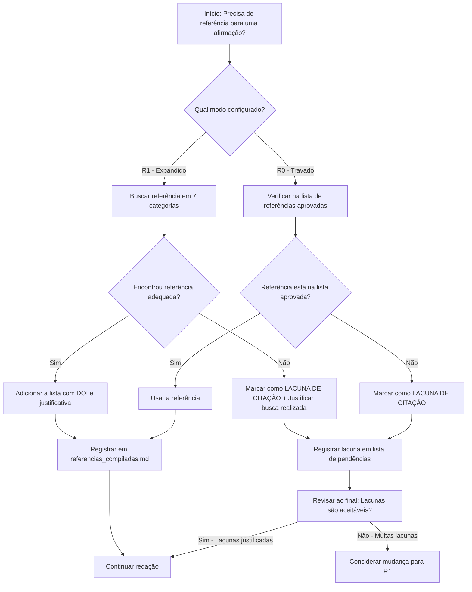

# Fluxograma de Decisão: R0 vs R1 - Políticas de Referências

## Visão Geral

Este documento define o fluxograma de decisão para escolha entre políticas de referências bibliográficas:
- **R0 (Referências Travadas)**: Conjunto fixo de referências pré-aprovadas
- **R1 (Referências Expandidas)**: Permite busca e adição de novas referências

---

## Fluxograma Principal



---

## Política R0: Referências Travadas

### Quando Usar

✅ **Use R0 quando**:
- Há restrições institucionais sobre citações
- Trabalha com conjunto pré-aprovado por orientador/comitê
- Acesso limitado a bases de dados acadêmicas (ex: sem Web of Science, Scopus)
- Artigo de revisão com escopo bem definido
- Necessidade de controle rigoroso de narrativa

### Regras R0

1. **NÃO ADICIONAR novas referências** durante a geração
2. **USAR APENAS** referências da lista aprovada em `config.json`:
   ```json
   {
     "reference_policy": "R0",
     "user_inputs": {
       "approved_references": [
         "Nielsen & Chuang (2010) - Quantum Computation and Quantum Information",
         "Preskill (2018) - Quantum Computing in the NISQ era",
         ...
       ]
     }
   }
   ```
3. Quando **falta referência**, marcar como:
   ```
   [LACUNA DE CITAÇÃO: Técnica X não tem referência na lista aprovada]
   ```
4. **Reportar lacunas** em documento separado ao final
5. **Justificar**: Por que a referência não pôde ser usada (não está na lista)

### Fluxo de Trabalho R0

```
1. Redator encontra necessidade de citação
2. Consulta lista de referências aprovadas
3. SE referência adequada existe:
     → Usar e citar
   SENÃO:
     → Marcar [LACUNA DE CITAÇÃO]
     → Registrar em lista_lacunas.md
4. Ao final, revisar lacunas com orientador/time
5. Decidir: Aceitar lacunas ou solicitar adição de referências específicas
```

### Exemplo R0

**Texto a escrever**:
> "Variational quantum circuits (VQCs) have shown promise for classification tasks..."

**Processo**:
1. Procurar referência para VQCs na lista aprovada
2. Lista contém: "Benedetti et al. (2019) - Parameterized quantum circuits..."
3. ✅ **Usar**: "...shown promise for classification tasks (BENEDETTI et al., 2019)."

**Texto a escrever**:
> "Recent work on quantum kernel methods shows..."

**Processo**:
1. Procurar referência para quantum kernels na lista aprovada
2. Lista NÃO contém nenhuma referência sobre kernels quânticos
3. ❌ **Marcar**: "Recent work on quantum kernel methods [LACUNA DE CITAÇÃO: quantum kernels não possui referência na lista aprovada] shows..."
4. Registrar em `lacunas_r0.md`

---

## Política R1: Referências Expandidas

### Quando Usar

✅ **Use R1 quando**:
- Tem acesso completo a bases de dados (Web of Science, Scopus, IEEE Xplore, arXiv)
- Quer maximizar fundamentação bibliográfica
- Artigo de pesquisa original com técnicas recentes
- Periódico-alvo exige revisão abrangente de literatura
- **Recomendado para Qualis A1**

### Regras R1

1. **PERMITIDO buscar e adicionar** novas referências
2. **OBRIGATÓRIO**:
   - Buscar em 7 categorias (ver abaixo)
   - Adicionar DOI quando disponível
   - Justificar relevância
   - Registrar critérios de busca
3. **PROIBIDO**:
   - Adicionar referências sem leitura/verificação
   - Usar auto-citação excessiva (>10%)
   - Ignorar trabalhos contraditórios (cherry-picking)
4. **Contrapontos OBRIGATÓRIOS**: Incluir perspectivas divergentes

### As 7 Categorias de Busca (R1)

#### 1. Referências Fundacionais
**Objetivo**: Conceitos fundamentais, teorias base  
**Critério**: Clássicos da área, >500 citações ou livros-texto  
**Exemplos**:
- Computação Quântica: Nielsen & Chuang (2010)
- Aprendizado de Máquina: Bishop (2006), Goodfellow et al. (2016)

**Busca**:
```
Google Scholar: "[conceito fundamental] textbook"
Filtro: >500 citações, livros
```

#### 2. Estado da Arte
**Objetivo**: Trabalhos recentes (últimos 2-3 anos)  
**Critério**: Publicações em periódicos top, preprints arXiv relevantes  
**Exemplos**:
- "Beneficial quantum noise" → buscar em arXiv:quant-ph (2022-2024)

**Busca**:
```
arXiv: "beneficial noise quantum" + filters: 2022-2024
Web of Science: TS=(quantum noise regularization) AND PY=(2022-2024)
```

#### 3. Referências Metodológicas
**Objetivo**: Técnicas/algoritmos específicos usados  
**Critério**: Artigo original que propôs o método  
**Exemplos**:
- Adam optimizer → Kingma & Ba (2015)
- Variational quantum eigensolver → Peruzzo et al. (2014)

**Busca**:
```
Google Scholar: "[nome do método] original paper"
Verificar ano de primeira publicação
```

#### 4. Referências Estatísticas
**Objetivo**: Métodos estatísticos aplicados  
**Critério**: Livros de estatística ou artigos metodológicos  
**Exemplos**:
- ANOVA → Montgomery (2017) "Design and Analysis of Experiments"
- Correção de Bonferroni → Dunn (1961)

**Busca**:
```
Google Scholar: "[método estatístico] methodology"
Preferir livros-texto ou review papers
```

#### 5. Frameworks e Bibliotecas
**Objetivo**: Software/ferramentas computacionais usadas  
**Critério**: Documentação oficial, artigos de release  
**Exemplos**:
- PennyLane → Bergholm et al. (2018)
- Qiskit → Aleksandrowicz et al. (2019)

**Busca**:
```
Documentação oficial do software
Papers citados na seção "Cite this work"
```

#### 6. Referências Críticas/Contrapontos
**Objetivo**: Trabalhos que contradizem ou limitam suas afirmações  
**Critério**: Artigos que mostram limitações, falhas, casos onde abordagem não funciona  
**Exemplos**:
- "Barren plateaus" em VQCs → McClean et al. (2018)
- Limitações de ruído benéfico → [buscar críticas]

**Busca**:
```
Google Scholar: "[seu método] limitations"
                "[seu método] fails"
                "[seu método] critique"
```

#### 7. Aplicações e Casos de Uso
**Objetivo**: Trabalhos que aplicaram técnicas similares  
**Critério**: Estudos empíricos em domínios relacionados  
**Exemplos**:
- VQCs em química quântica
- Noise injection em aprendizado de máquina clássico

**Busca**:
```
Web of Science: TS=(variational quantum classifier applications)
Scopus: TITLE-ABS-KEY(noise injection AND machine learning)
```

### Fluxo de Trabalho R1

```
1. Redator identifica necessidade de citação
2. Determinar categoria (1-7)
3. Buscar em bases de dados apropriadas:
   - Google Scholar (busca ampla)
   - Web of Science / Scopus (qualidade)
   - arXiv (recente, preprints)
   - IEEE Xplore / ACM Digital Library (computação)
   - PubMed (se aplicável a bio/medicina)
4. Avaliar referência:
   - Relevância: 1-5 estrelas
   - Qualidade: Journal Rank, citações
   - Acesso ao PDF: Disponível?
5. SE adequada:
     → Adicionar a referencias_compiladas.md
     → Extrair DOI
     → Anotar justificativa
6. SE não encontrou:
     → Marcar [LACUNA DE CITAÇÃO] com histórico de busca
```

### Template de Referência (R1)

```markdown
## [Categoria X] - [Título abreviado]

**Referência Completa (ABNT)**:
AUTOR(ES). **Título completo**. *Periódico*, v. X, n. Y, p. Z-W, Ano. DOI: 10.xxxx/xxxxx

**Categoria**: [1-7]  
**Relevância**: ⭐⭐⭐⭐⭐ (5/5)  
**DOI**: 10.xxxx/xxxxx  
**Citações (Google Scholar)**: XXXX  
**Ano**: 20XX  

**Justificativa**:
Por que esta referência é necessária para o artigo. Exemplo:
"Esta referência é fundamental porque introduziu o conceito de [X] que usamos na seção de metodologia. É o artigo original que propôs [técnica Y]."

**Achados-Chave**:
- Achado 1
- Achado 2

**Contraponto (se aplicável)**:
"No entanto, [Autor Z, 20YY] argumenta que..."
```

### Exemplo R1 Completo

**Texto a escrever**:
> "Noise injection has been used as a regularization technique in classical machine learning..."

**Processo**:
1. **Categoria**: 7 (Aplicações em ML clássico)
2. **Busca**: Google Scholar → "noise injection regularization dropout"
3. **Encontrado**: Srivastava et al. (2014) "Dropout: A simple way to prevent..."
4. **Avaliar**:
   - Relevância: ⭐⭐⭐⭐⭐ (fundacional para dropout)
   - Citações: ~25,000 (altíssimo impacto)
   - DOI: Disponível
5. **Adicionar**:
   ```markdown
   ## [Categoria 7] - Dropout como Regularização
   
   **Referência Completa**:
   SRIVASTAVA, N. et al. **Dropout: A simple way to prevent neural networks from overfitting**. 
   *The Journal of Machine Learning Research*, v. 15, n. 1, p. 1929-1958, 2014.
   
   **DOI**: (procurar)
   **Justificativa**: Paralelo entre dropout (ruído em ML clássico) e ruído quântico.
   ```
6. **Citar no texto**:
   > "...in classical machine learning (SRIVASTAVA et al., 2014), suggesting a parallel..."

---

## Decisão: R0 ou R1?

### Árvore de Decisão

```
PERGUNTA 1: Você tem acesso a Web of Science, Scopus ou IEEE Xplore?
├─ SIM → Continue
└─ NÃO → Use R0 (acesso limitado)

PERGUNTA 2: Sua instituição/orientador exige lista pré-aprovada de referências?
├─ SIM → Use R0 (restrição institucional)
└─ NÃO → Continue

PERGUNTA 3: O artigo é para periódico Qualis A1 ou equivalente internacional?
├─ SIM → Use R1 (máxima fundamentação)
└─ NÃO → Continue

PERGUNTA 4: Você tem tempo para busca bibliográfica extensiva (2-4 semanas)?
├─ SIM → Use R1 (tempo disponível)
└─ NÃO → Use R0 (prazo apertado)

PERGUNTA 5: Há técnicas muito recentes (<2 anos) no seu trabalho?
├─ SIM → Use R1 (precisa de refs recentes)
└─ NÃO → R0 pode ser suficiente
```

### Tabela Comparativa

| Critério | R0 | R1 |
|----------|----|----|
| **Acesso a bases de dados** | Limitado | Completo |
| **Tempo de busca** | Baixo (~5h) | Alto (~20-30h) |
| **Número de referências** | 20-35 | 35-60 |
| **Rigor bibliográfico** | Médio | Alto |
| **Risco de lacunas** | Médio-Alto | Baixo |
| **Adequado para Qualis A1** | Depende | ✅ Sim |
| **Contrapontos** | Pode faltar | ✅ Incluídos |
| **DOIs** | Nem todos | ✅ Todos |

---

## Mudança de R0 para R1 Durante o Processo

### Quando mudar?

Se iniciou com R0 mas identificou **≥5 lacunas críticas**, considere mudar para R1.

**Lacuna crítica**: Falta referência para:
- Técnica central do método
- Afirmação quantitativa importante
- Conceito teórico fundamental

### Procedimento de mudança

```bash
# 1. Atualizar config.json
sed -i 's/"reference_policy": "R0"/"reference_policy": "R1"/g' config.json

# 2. Revisar lacunas
cat lacunas_r0.md

# 3. Buscar referências para cada lacuna
# (Seguir fluxo R1 nas 7 categorias)

# 4. Atualizar referencias_compiladas.md

# 5. Reger lacunas resolvidas
# (Remover marcadores [LACUNA DE CITAÇÃO])

# 6. Regenerar seções afetadas
python gerador_artigo_completo.py --regenerate fase3_literatura fase4_redacao
```

---

## Ferramentas de Busca Recomendadas

### Bases de Dados Principais

| Base | Melhor para | Acesso |
|------|-------------|--------|
| **Google Scholar** | Busca ampla, encontrar clássicos | Gratuito |
| **Web of Science** | Qualidade, fator de impacto | Institucional |
| **Scopus** | Cobertura ampla, métricas | Institucional |
| **arXiv** | Preprints, trabalhos recentes | Gratuito |
| **IEEE Xplore** | Computação, engenharia | Institucional |
| **PubMed** | Biomedicina | Gratuito |
| **ACM Digital Library** | Ciência da Computação | Institucional |

### Ferramentas Auxiliares

- **Connected Papers**: Visualizar grafo de citações
- **Semantic Scholar**: Busca semântica, resumos AI
- **Zotero / Mendeley**: Gerenciamento de referências
- **CrossRef**: Buscar DOIs
- **DOI.org**: Resolver DOIs para artigos

---

## Registro de Referências (R1)

### Planilha de Controle

| ID | Categoria | Busca realizada | Referência encontrada | DOI | Status |
|----|-----------|-----------------|----------------------|-----|--------|
| R001 | 1 (Fundacional) | "quantum computation textbook" | Nielsen & Chuang (2010) | 10.1017/CBO978... | ✅ Adicionada |
| R002 | 2 (Estado da Arte) | arXiv:"beneficial noise" 2023 | Du et al. (2023) | arXiv:2301.xxxxx | ✅ Adicionada |
| R003 | 6 (Críticas) | "VQC limitations barren plateaus" | McClean et al. (2018) | 10.1038/s41467-018... | ✅ Adicionada |

---

## Quality Gate de Referências

### Checklist (R0)

- [ ] Todas as referências usadas estão na lista aprovada
- [ ] Lacunas documentadas e justificadas
- [ ] Nenhuma referência não-aprovada foi adicionada
- [ ] Lista de lacunas revisada com orientador

### Checklist (R1)

- [ ] Buscas realizadas nas 7 categorias
- [ ] Todos os DOIs presentes (quando disponíveis)
- [ ] Contrapontos incluídos (categoria 6)
- [ ] 35-60 referências no total
- [ ] Menos de 5 lacunas críticas
- [ ] Auto-citação < 10%

---

**Versão do Template**: 1.0  
**Última Atualização**: 26/12/2025  
**Compatível com**: ABNT NBR 6023, APA 7th, IEEE, Nature styles
