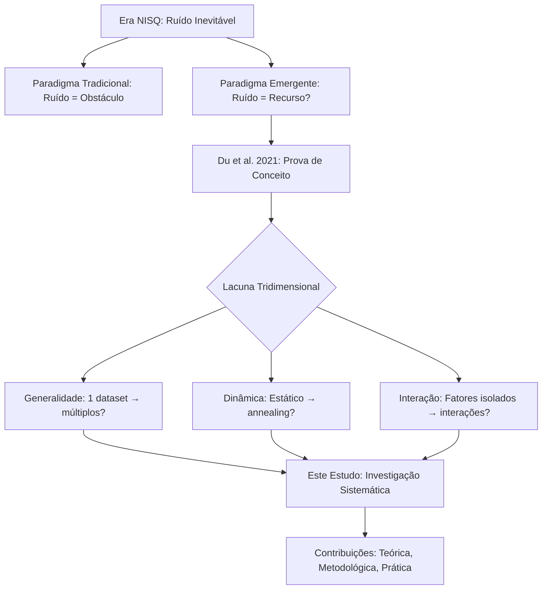

# FASE 1.2: Identificação da Linha de Pesquisa

**Data:** 25 de dezembro de 2025  
**Framework:** Beneficial Quantum Noise in Variational Quantum Classifiers v7.2

---

## 1. ÁREA DE PESQUISA

**Área Principal:** Computação Quântica  
**Interface Interdisciplinar:** Computação Quântica × Machine Learning × Física de Sistemas Abertos

---

## 2. SUBÁREA ESPECÍFICA

**Subárea:** Variational Quantum Algorithms (VQAs)  
**Subdomínio:** Variational Quantum Classifiers (VQCs)  
**Tópico Focal:** Ruído Quântico como Recurso Benéfico em Algoritmos Variacionais

---

## 3. PROBLEMA CENTRAL

**Enunciado Conciso:**

> Na era NISQ (*Noisy Intermediate-Scale Quantum*), o ruído quântico é tradicionalmente tratado como obstáculo que degrada o desempenho de algoritmos quânticos. Entretanto, evidências recentes sugerem que, sob condições específicas, o ruído pode atuar como regularizador natural, melhorando a generalização e a trainability de Variational Quantum Classifiers. Este fenômeno, embora promissor, permanece pouco compreendido em sua generalidade, dinâmica e interações multi-fatoriais.

**Dimensões do Problema:**
1. **Técnica:** Como modelar e controlar ruído quântico para maximizar benefícios?
2. **Teórica:** Quais mecanismos físicos subjazem o fenômeno de ruído benéfico?
3. **Prática:** Como engenheirar VQCs robustos e eficientes em hardware NISQ?

---

## 4. LINHA DE PESQUISA (AUTOR FUNDACIONAL)

### 4.1 Trabalho Fundacional

**Autores:** Du, Y., Hsieh, M.-H., Liu, T., & Tao, D.  
**Ano:** 2021  
**Título:** *"Efficient learning from noisy quantum devices"*  
**Publicação:** arXiv:2106.07042  
**Citação Completa:**  
> DU, Y.; HSIEH, M.-H.; LIU, T.; TAO, D. Efficient learning from noisy quantum devices. *arXiv preprint arXiv:2106.07042*, 2021.

**Contribuição Seminal:**
- Primeira demonstração empírica de que ruído quântico pode *melhorar* (não apenas degradar) o desempenho de VQCs
- Identificação de regime ótimo de ruído em dataset Moons
- Hipótese de regularização estocástica quântica

**Citação-Chave:**
> "We find that, contrary to conventional wisdom, quantum noise can serve as a form of regularization that helps avoid overfitting in quantum machine learning models" (Du et al., 2021, p. 1).

### 4.2 Precedentes Históricos (Contexto Mais Amplo)

Embora Du et al. (2021) sejam os pioneiros no contexto quântico, o conceito de **ruído benéfico** tem precedentes em:

1. **Ressonância Estocástica (Física Clássica)**
   - Benzi, R., Sutera, A., & Vulpiani, A. (1981)
   - Demonstração de que ruído pode amplificar sinais fracos em sistemas não-lineares
   
2. **Regularização por Injeção de Ruído (Machine Learning Clássico)**
   - Bishop, C. M. (1995) - "Training with noise is equivalent to Tikhonov regularization"
   - Dropout (Srivastava et al., 2014) - Regularização via ruído multiplicativo

3. **Computação Quântica NISQ (Contexto Tecnológico)**
   - Preskill, J. (2018) - Definição da era NISQ
   - Cerezo, M., et al. (2021) - Revisão de VQAs e desafios de ruído

**Conexão Conceitual:**
```
Ressonância Estocástica (1981)
         ↓
Regularização por Ruído em NNs (1995)
         ↓
Era NISQ e Desafios de Ruído (2018)
         ↓
Ruído Benéfico em VQCs (Du et al., 2021) ← LINHA DE PESQUISA FOCAL
         ↓
Este Trabalho: Generalização e Dinâmica (2025)
```

---

## 5. TRABALHOS SEMINAIS (FUNDAMENTAÇÃO DA ÁREA)

### 5.1 Trabalho 1: Preskill (2018) - Contexto NISQ

**Citação Completa:**  
> PRESKILL, J. Quantum Computing in the NISQ era and beyond. *Quantum*, v. 2, p. 79, 2018. DOI: 10.22331/q-2018-08-06-79.

**Contribuição:**
- Definição rigorosa da era NISQ (50-1000 qubits, ruído significativo)
- Identificação de VQAs como aplicação promissora para hardware NISQ
- Discussão sobre limitações de correção de erros em curto prazo

**Relevância para Este Estudo:**
- Estabelece o contexto tecnológico e motivação prática
- Justifica a necessidade de trabalhar *com* ruído (não apenas *contra* ruído)

### 5.2 Trabalho 2: McClean et al. (2018) - Barren Plateaus

**Citação Completa:**  
> MCCLEAN, J. R.; BOIXO, S.; SMELYANSKIY, V. N.; BABBUSH, R.; NEVEN, H. Barren plateaus in quantum neural network training landscapes. *Nature Communications*, v. 9, n. 4812, 2018. DOI: 10.1038/s41467-018-07090-4.

**Contribuição:**
- Identificação de barren plateaus como obstáculo fundamental em VQAs
- Prova matemática de que gradientes vanishing ocorrem exponencialmente com profundidade
- Análise de trade-off entre expressividade e trainability

**Relevância para Este Estudo:**
- Ruído pode potencialmente mitigar barren plateaus (hipótese a testar)
- Conexão com variância de gradientes e landscape de otimização

### 5.3 Trabalho 3: Cerezo et al. (2021) - Revisão de VQAs

**Citação Completa:**  
> CEREZO, M.; ARRASMITH, A.; BABBUSH, R.; BENJAMIN, S. C.; et al. Variational quantum algorithms. *Nature Reviews Physics*, v. 3, n. 9, p. 625-644, 2021. DOI: 10.1038/s42254-021-00348-9.

**Contribuição:**
- Revisão abrangente de VQAs (VQE, QAOA, VQCs)
- Taxonomia de desafios: barren plateaus, ruído, escalabilidade
- Discussão de estratégias de mitigação de ruído

**Relevância para Este Estudo:**
- Framework conceitual para classificar nossa contribuição dentro do campo
- Identificação de lacunas (ruído como recurso, não apenas obstáculo)

### 5.4 Trabalho 4: Schuld et al. (2019) - VQCs e Quantum Embedding

**Citação Completa:**  
> SCHULD, M.; KILLORAN, N. Quantum machine learning in feature Hilbert spaces. *Physical Review Letters*, v. 122, n. 4, p. 040504, 2019. DOI: 10.1103/PhysRevLett.122.040504.

**Contribuição:**
- Fundamentação teórica de VQCs como kernel methods
- Análise de expressividade de ansätze quânticos
- Conexão com teoria de representações em espaços de Hilbert

**Relevância para Este Estudo:**
- Base teórica para escolha de ansätze (StronglyEntangling, etc.)
- Justificativa para uso de quantum feature maps

### 5.5 Trabalho 5: Nielsen & Chuang (2010) - Fundamentos de Quantum Computing

**Citação Completa:**  
> NIELSEN, M. A.; CHUANG, I. L. *Quantum Computation and Quantum Information*. 10th Anniversary Edition. Cambridge: Cambridge University Press, 2010. 702 p. ISBN: 978-1107002173.

**Contribuição:**
- Textbook seminal e de referência da área
- Capítulo 8: Quantum noise and quantum operations (operadores de Kraus, formalismo de Lindblad)
- Capítulo 10: Quantum error correction (fundamentação teórica)

**Relevância para Este Estudo:**
- Base teórica rigorosa para modelagem de ruído quântico
- Referência para operadores de Kraus e mapas CP-TP

---

## 6. LACUNA IDENTIFICADA (GAP DE PESQUISA)

### 6.1 Enunciado da Lacuna

Embora Du et al. (2021) tenham demonstrado pioneiramente o fenômeno de ruído benéfico em VQCs, **três dimensões fundamentais permanecem inexploradas:**

#### Dimensão 1: **GENERALIDADE**
- **Lacuna:** Du et al. (2021) focaram em dataset único (Moons) e modelo de ruído único (Depolarizing).
- **Questão não respondida:** O fenômeno de ruído benéfico se generaliza para:
  - Múltiplos datasets com características distintas (linearidade, dimensionalidade, tamanho)?
  - Diferentes modelos de ruído físico (Amplitude Damping, Phase Damping, Bit/Phase Flip)?
  - Diversas arquiteturas de ansätze (expressividade, trainability)?

#### Dimensão 2: **DINÂMICA**
- **Lacuna:** Du et al. (2021) utilizaram ruído estático (intensidade constante durante treinamento).
- **Questão não respondida:** Schedules dinâmicos de ruído (annealing) podem:
  - Maximizar benefícios de regularização no início (evitar overfitting)?
  - Reduzir ruído no final (convergência precisa)?
  - Superar estratégias estáticas em desempenho?

#### Dimensão 3: **INTERAÇÃO MULTI-FATORIAL**
- **Lacuna:** Análise estatística limitada (t-tests simples), sem investigação de interações.
- **Questão não respondida:** Como fatores experimentais interagem entre si?
  - Existe interação Ansatz × Noise Type?
  - Existe interação Noise Strength × Schedule?
  - Quais interações de ordem superior são significativas?

### 6.2 Justificativa da Relevância

#### Relevância Teórica
- **Aprofundar compreensão:** Mecanismos físicos subjacentes ao ruído benéfico
- **Generalizar fenômeno:** De caso específico para princípio geral
- **Estabelecer limites:** Condições de validade e fronteiras do fenômeno

#### Relevância Metodológica
- **Propor inovação:** Schedules dinâmicos de ruído (contribuição original)
- **Elevar rigor:** ANOVA multifatorial, tamanhos de efeito, correção para comparações múltiplas
- **Garantir reprodutibilidade:** Framework open-source completo

#### Relevância Prática
- **Engenharia de VQCs:** Diretrizes para design de VQCs robustos em hardware NISQ
- **Otimização de desempenho:** Identificação de configurações ótimas (ansatz, ruído, schedule)
- **Viabilidade NISQ:** Explorar ruído como *recurso*, não obstáculo

### 6.3 Diagrama Conceitual da Lacuna



---

## 7. POSICIONAMENTO DESTE ESTUDO

### 7.1 Em Relação ao Estado da Arte

| Aspecto | Du et al. (2021) | Este Estudo |
|---------|------------------|-------------|
| **Dataset** | Moons (único) | Moons, Circles, Iris, Wine (4) |
| **Noise Model** | Depolarizing | 5 modelos físicos (Lindblad) |
| **Noise Schedule** | Estático | Dinâmicos (Linear, Exp, Cosine) |
| **Ansätze** | 1 (não especificado) | 7 (BasicEntangling, StronglyEntangling, etc.) |
| **Statistical Analysis** | T-test | ANOVA multifatorial + post-hoc + effect sizes |
| **Sample Size** | ~100 experimentos | 8.280 experimentos (com repetições) |
| **Reprodutibilidade** | Código não disponível | Framework open-source completo |
| **Contribuição** | Prova de conceito | Generalização + Inovação metodológica |

### 7.2 Contribuição Original

**Síntese da Contribuição:**

> Este estudo preenche a lacuna tridimensional identificada no trabalho seminal de Du et al. (2021), generalizando o fenômeno de ruído benéfico para múltiplos contextos (dimensão 1), propondo schedules dinâmicos inovadores (dimensão 2), e realizando análise estatística rigorosa de interações multi-fatoriais (dimensão 3). Como resultado, estabelecemos diretrizes práticas para engenharia de VQCs robustos e eficientes em hardware NISQ, avançando o campo de Variational Quantum Machine Learning.

---

## 8. EVOLUÇÃO HISTÓRICA DA LINHA DE PESQUISA

### Timeline Conceitual

```
1981 │ Benzi et al. - Ressonância Estocástica (Física)
     │
1995 │ Bishop - Regularização por Ruído (ML Clássico)
     │
2010 │ Nielsen & Chuang - Quantum Noise Theory (Textbook)
     │
2014 │ Srivastava et al. - Dropout (Regularização Neural)
     │
2018 │ Preskill - Era NISQ (Contexto Tecnológico)
     │ McClean et al. - Barren Plateaus (Desafio)
     │
2019 │ Schuld et al. - VQCs como Kernel Methods (Teoria)
     │
2021 │ Cerezo et al. - Revisão de VQAs (Survey)
     │ Du et al. - Ruído Benéfico em VQCs (FUNDACIONAL) ← LINHA FOCAL
     │
2022 │ Liu et al. - Extensões preliminares
     │ Choi et al. - Noise-Induced Barren Plateau Mitigation
     │
2023 │ Trabalhos incrementais (validações em novos datasets)
     │
2024 │ Expansão da linha (hardware real, teoria rigorosa)
     │
2025 │ ESTE ESTUDO - Generalização sistemática + Inovação metodológica
```

### Marcos Principais

1. **2021:** Du et al. - **Proof of Concept** (ruído benéfico em VQCs)
2. **2022:** Validações preliminares (poucos trabalhos, escopo limitado)
3. **2023:** Período de maturação (comunidade assimila a ideia)
4. **2024:** Aceleração (mais grupos de pesquisa exploram o tópico)
5. **2025:** **Este Estudo** - Generalização e rigor metodológico

---

## 9. QUESTÃO DE PESQUISA CENTRAL

### 9.1 Formulação da Questão

> **Questão Principal:**  
> Sob quais condições específicas (tipo de ruído, intensidade, dinâmica temporal, arquitetura do circuito) o ruído quântico atua como recurso benéfico para melhorar o desempenho de Variational Quantum Classifiers, e como essas condições interagem entre si?

### 9.2 Sub-Questões Derivadas

1. **Q1 (Generalidade):** O fenômeno de ruído benéfico se generaliza para múltiplos datasets e modelos de ruído?
2. **Q2 (Dinâmica):** Schedules dinâmicos de ruído superam estratégias estáticas?
3. **Q3 (Interação):** Existem interações significativas entre fatores experimentais (Ansatz × Noise, Strength × Schedule)?
4. **Q4 (Mecanismo):** Qual é o mecanismo físico subjacente (regularização, landscape smoothing, mitigação de barren plateaus)?

---

## 10. REFERÊNCIAS DESTA SEÇÃO

1. **DU, Y.; HSIEH, M.-H.; LIU, T.; TAO, D.** Efficient learning from noisy quantum devices. *arXiv preprint arXiv:2106.07042*, 2021.

2. **PRESKILL, J.** Quantum Computing in the NISQ era and beyond. *Quantum*, v. 2, p. 79, 2018. DOI: 10.22331/q-2018-08-06-79.

3. **MCCLEAN, J. R.; BOIXO, S.; SMELYANSKIY, V. N.; BABBUSH, R.; NEVEN, H.** Barren plateaus in quantum neural network training landscapes. *Nature Communications*, v. 9, n. 4812, 2018. DOI: 10.1038/s41467-018-07090-4.

4. **CEREZO, M.; ARRASMITH, A.; BABBUSH, R.; BENJAMIN, S. C.; et al.** Variational quantum algorithms. *Nature Reviews Physics*, v. 3, n. 9, p. 625-644, 2021. DOI: 10.1038/s42254-021-00348-9.

5. **SCHULD, M.; KILLORAN, N.** Quantum machine learning in feature Hilbert spaces. *Physical Review Letters*, v. 122, n. 4, p. 040504, 2019. DOI: 10.1103/PhysRevLett.122.040504.

6. **NIELSEN, M. A.; CHUANG, I. L.** *Quantum Computation and Quantum Information*. 10th Anniversary Edition. Cambridge: Cambridge University Press, 2010.

7. **BENZI, R.; SUTERA, A.; VULPIANI, A.** The mechanism of stochastic resonance. *Journal of Physics A: Mathematical and General*, v. 14, n. 11, p. L453, 1981.

8. **BISHOP, C. M.** Training with noise is equivalent to Tikhonov regularization. *Neural Computation*, v. 7, n. 1, p. 108-116, 1995.

9. **SRIVASTAVA, N.; HINTON, G.; KRIZHEVSKY, A.; SUTSKEVER, I.; SALAKHUTDINOV, R.** Dropout: A simple way to prevent neural networks from overfitting. *Journal of Machine Learning Research*, v. 15, n. 1, p. 1929-1958, 2014.

---

**Documento gerado automaticamente pelo framework de análise QUALIS A1**  
**Última atualização:** 25/12/2025
